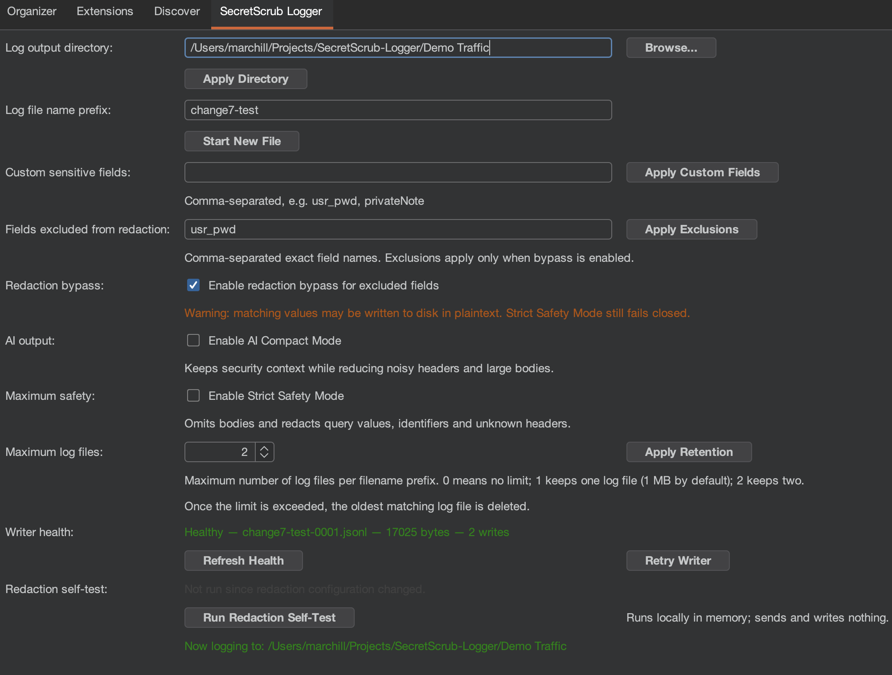

# SecretScrub Logger

Burp traffic is brilliant context for testing and AI-assisted analysis. It is also full of things
that should not casually end up in a prompt, a shared folder or source control.

SecretScrub Logger is a lightweight Burp Suite Professional extension that records completed,
in-scope HTTP traffic as JSONL and scrubs likely secrets before the traffic reaches disk. It uses
the JDK and Montoya API only, with no extra runtime dependencies.



The screenshot shows the full extension tab, including a deliberately enabled redaction bypass.
That switch is off by default and comes with a warning for good reason.

## What it does

- Logs completed HTTP transactions only when they are in Burp's Target Scope.
- Skips common static assets such as images, fonts, JavaScript, CSS, maps, PDFs and archives.
- Redacts sensitive headers, cookies, URL parameters, path values, JSON, forms, multipart and XML.
- Detects bearer tokens and JWT-shaped values even when the field name is unfamiliar.
- Accepts custom sensitive field names for application-specific secrets such as `usr_pwd`.
- Marks captured content as untrusted and includes redaction, truncation and omission metadata.
- Rotates numbered JSONL files, applies owner-only permissions and can prune old rotations.
- Shows writer health and includes an in-memory redaction self-test.

Requests and responses are capped at 100 KB each. Log files rotate at 1 MB by default.

## Build it on macOS

You need JDK 21. The build targets Java 17 bytecode for compatibility with Burp Suite's extension
runtime. Maven does not need to be installed separately; the wrapper is included.

```sh
./mvnw clean test
./mvnw package
```

The finished extension is `target/secretscrub-logger.jar`.

If Homebrew's JDK 21 is installed but your shell cannot find it, add this to `~/.zshrc`:

```sh
export PATH="/opt/homebrew/opt/openjdk@21/bin:$PATH"
export JAVA_HOME="/opt/homebrew/opt/openjdk@21"
```

Open a new terminal, then check `java -version` and `./mvnw -version`.

## Load it in Burp

1. Build the jar with `./mvnw package`.
2. Open **Extensions → Installed → Add** in Burp.
3. Choose **Java**, then select `target/secretscrub-logger.jar`.
4. Add the hosts you want to record to Burp's Target Scope.
5. Open the **SecretScrub Logger** tab and choose an output directory.

The default directory is `~/SecretScrubLogs`. Each line in a log is one HTTP transaction:

```json
{"t":"2026-08-30T12:00:00Z","method":"GET","url":"https://example.com/api/users","status":200,"request":"...","response":"...","meta":{"schemaVersion":1,"contentTrust":"untrusted","captureMode":"full","safetyMode":"standard","redaction":{"performed":true,"count":2}}}
```

The `meta` object is additive, so readers using the original fields remain compatible. Redaction
counts are recorded before truncation. Always treat the captured request and response text as
untrusted data, even when the redaction metadata reports success.

## Safety controls

The normal mode keeps useful HTTP context while replacing likely secrets with `[REDACTED]`. Two
optional modes can reduce what is retained further:

| Setting | What changes |
| --- | --- |
| **AI Compact Mode** | Removes routine HTTP noise after redaction and caps each body at 16 KB. |
| **Strict Safety Mode** | Omits bodies, redacts query values and identifiers, and fails unknown headers closed. |

The modes can be enabled together. Every record states the active capture and safety modes in its
metadata.

### Custom sensitive fields

Add comma-separated field names such as `usr_pwd` or `privateNote`, then click **Apply Custom
Fields**. Matching is case-insensitive and treats common separators consistently, so `usr_pwd`,
`Usr-Pwd` and `usrPwd` are equivalent. Custom names are persisted in Burp.

### Deliberate redaction exclusions

Sometimes plaintext is useful in a controlled training environment. Add exact names under
**Fields excluded from redaction**, apply them, and explicitly enable the bypass checkbox. In
standard mode, matching headers, cookies, query and form parameters, JSON keys, multipart fields
and XML values will be kept—even when the value looks like a JWT.

There is no protected-name blocklist: this is the tester's decision. The log metadata records only
the number of configured exclusions, never their names. Strict Safety Mode ignores exclusions and
still fails closed. Turn the bypass off as soon as the test that needs it is finished.

### Retention, permissions and writer health

On macOS, the selected directory is restricted to the current user (`0700`) and active log files
use `0600`. Symbolic links are not followed as active logs.

Retention is off by default. **Maximum log files** applies only to the current filename prefix: `0`
keeps every rotation, `1` keeps one, `2` keeps two, and so on. When the limit is exceeded, the
oldest matching rotation is removed. Other prefixes and symbolic links are left alone.

Writer Health shows the active file, its size and successful write count. If opening, rotating or
writing fails, logging stops. Fix the disk or permission problem and use **Retry Writer**.

### Redaction self-test

**Run Redaction Self-Test** checks URL, header, cookie, JSON, JWT, form, XML, multipart, malformed
and escaped-data cases with synthetic canaries. It also checks custom sensitive fields and active
exclusions. The test runs entirely in memory: it sends nothing and writes nothing. A pass is a
useful smoke test for the loaded build and current settings, not a promise that every possible
application secret can be recognised.

## Optional runtime settings

Change the starting log directory:

```sh
-Dsecretscrublogger.dir=/path/to/logs
```

Change the 1 MB rotation threshold:

```sh
-Dsecretscrublogger.maxBytes=2097152
```

Raw HTTP traffic is security-sensitive material. SecretScrub is deliberately conservative, but
its logs still deserve the same care as the traffic they came from.
